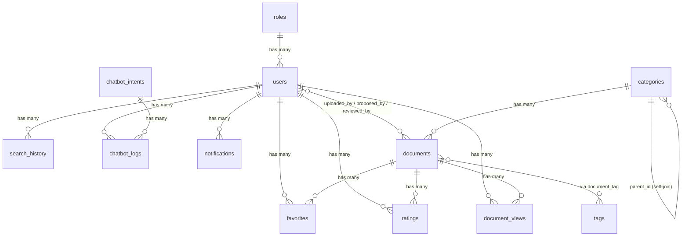

# Instruction — Backend Project: Tri Thức Số (Laravel 11)

> Tài liệu kỹ thuật nội bộ. Đọc từ đầu đến cuối trước khi fix bug hay phát triển feature mới.

---

## Mục lục

1. [Giới thiệu Project](#1-giới-thiệu-project)
2. [Tech Stack](#2-tech-stack)
3. [Yêu cầu môi trường](#3-yêu-cầu-môi-trường)
4. [Cài đặt local](#4-cài-đặt-local)
5. [Cấu trúc thư mục](#5-cấu-trúc-thư-mục)
6. [Database Schema](#6-database-schema)
7. [Models & Relationships](#7-models--relationships)
8. [Authentication & Authorization](#8-authentication--authorization)
9. [Middleware](#9-middleware)
10. [API Routes — TẤT CẢ endpoints](#10-api-routes--tất-cả-endpoints)
11. [Luồng xử lý chi tiết](#11-luồng-xử-lý-chi-tiết)
12. [Services Layer](#12-services-layer)
13. [⭐ Luồng Chatbot (AI Rules-based)](#-luồng-chatbot-ai-rules-based)
14. [⭐ Thuật toán Home Page & Recommendation](#-thuật-toán-home-page--recommendation)
15. [⭐ Tìm kiếm & Synonym Expansion](#-tìm-kiếm--synonym-expansion)
16. [Các luồng nghiệp vụ quan trọng khác](#16-các-luồng-nghiệp-vụ-quan-trọng-khác)
17. [Validation (FormRequest)](#17-validation-formrequest)
18. [API Resources](#18-api-resources)
19. [Helper: ApiResponse](#19-helper-apiresponse)
20. [Bảng thư viện Composer](#20-bảng-thư-viện-composer)
21. [Artisan commands hữu ích](#21-artisan-commands-hữu-ích)
22. [Queue & Scheduled Tasks](#22-queue--scheduled-tasks)
23. [Testing](#23-testing)
24. [Deploy lên Production](#24-deploy-lên-production)
25. [Troubleshooting thường gặp](#25-troubleshooting-thường-gặp)
26. [Onboarding checklist cho dev mới](#26-onboarding-checklist-cho-dev-mới)
27. [⚠️ Phát hiện cần lưu ý](#️-phát-hiện-cần-lưu-ý)

---

## 1. Giới thiệu Project

**Tri Thức Số** là REST API backend cho nền tảng thư viện tài liệu số. Backend nhận request từ Vue SPA, trả JSON thuần — không render HTML.

**Đối tượng người dùng trong hệ thống:**

| Role | Slug | Mô tả |
|---|---|---|
| Admin | `admin` | Quản trị toàn hệ thống: CRUD tài liệu, user, category, chatbot, duyệt đề xuất |
| Giảng viên | `teacher` | Đề xuất tài liệu mới để admin duyệt |
| Sinh viên | `student` | Đọc, tải, yêu thích, đánh giá tài liệu |
| Khách | (guest) | Duyệt danh mục, xem chi tiết tài liệu, dùng chatbot, tìm kiếm (không cần đăng nhập) |

- **Frontend URL**: https://trithucso.oceanmind.id.vn (SPA kết nối tới backend này)
- **Production API URL**: https://api.trithucso.oceanmind.id.vn
- **API prefix**: `/api/v1/*`

---

## 2. Tech Stack

| Công nghệ | Version | Mục đích |
|---|---|---|
| PHP | ^8.2 | Runtime |
| Laravel | ^11.0 | Framework chính |
| Laravel Sanctum | ^4.3 | API authentication (Bearer token) |
| MySQL | 8.0 | Database chính |
| Laravel Tinker | ^2.9 | REPL debug |
| Laravel Pint | ^1.13 | Code formatter (dev) |
| Laravel Sail | ^1.26 | Docker dev environment (dev) |
| PHPUnit | ^10.5 | Test framework |
| Faker | ^1.23 | Fake data cho seeders/factories (dev) |
| Mockery | ^1.6 | Mock cho unit test (dev) |
| Ignition | ^2.4 | Error page đẹp hơn (dev) |

---

## 3. Yêu cầu môi trường

- **PHP**: >= 8.2 với các extension: `pdo_mysql`, `mbstring`, `intl` (cho `Normalizer::class`), `json`, `openssl`, `tokenizer`, `xml`, `ctype`, `bcmath`
- **Composer**: >= 2.0
- **MySQL**: >= 8.0 (bắt buộc MySQL vì dùng FULLTEXT INDEX và custom index syntax không tương thích SQLite)
- **Redis**: Không bắt buộc — `CACHE_STORE=file`, `QUEUE_CONNECTION=sync` theo mặc định
- **Node.js**: Không cần (Laravel này không dùng Vite assets frontend)

---

## 4. Cài đặt local

```bash
# 1. Clone repository
git clone <repo-url>
cd TriThucSo/backend

# 2. Cài dependencies
composer install

# 3. Tạo file .env
cp .env.example .env

# 4. Generate APP_KEY
php artisan key:generate

# 5. Tạo database (trong MySQL)
# mysql -u root -p
# CREATE DATABASE tri_thuc_so CHARACTER SET utf8mb4 COLLATE utf8mb4_unicode_ci;

# 6. Chạy migrations + seeders
php artisan migrate --seed

# 7. Chạy dev server (port 8000)
php artisan serve
```

### Tài khoản test sau khi seed

| Role | Email | Password |
|---|---|---|
| Admin | admin@tts.com | Admin@123 |
| Teacher | teacher@tts.com | Teacher@123 |
| Student | student@tts.com | Student@123 |

### Tất cả biến môi trường trong `.env`

| Biến | Giá trị mẫu | Bắt buộc | Mô tả |
|---|---|---|---|
| `APP_NAME` | `"Tri Thuc So"` | Có | Tên app (hiện trong mail) |
| `APP_ENV` | `local` | Có | Môi trường: `local`, `production` |
| `APP_KEY` | `base64:...` | Có | Key mã hóa — bắt buộc generate sau khi clone |
| `APP_DEBUG` | `true` | Có | `false` trên production |
| `APP_URL` | `http://localhost:8000` | Có | URL backend — dùng trong password reset link |
| `APP_LOCALE` | `vi` | Không | Locale mặc định |
| `APP_FALLBACK_LOCALE` | `en` | Không | Fallback locale |
| `LOG_CHANNEL` | `stack` | Không | Log driver |
| `LOG_LEVEL` | `debug` | Không | `error` trên production |
| `DB_CONNECTION` | `mysql` | Có | Phải là `mysql` (dùng FULLTEXT index) |
| `DB_HOST` | `127.0.0.1` | Có | MySQL host |
| `DB_PORT` | `3306` | Không | MySQL port |
| `DB_DATABASE` | `tri_thuc_so` | Có | Tên database |
| `DB_USERNAME` | `root` | Có | MySQL user |
| `DB_PASSWORD` | _(rỗng)_ | Có | MySQL password |
| `SESSION_DRIVER` | `file` | Không | Session driver (không quan trọng với API token auth) |
| `SESSION_LIFETIME` | `120` | Không | Session TTL tính bằng phút |
| `BROADCAST_CONNECTION` | `log` | Không | Broadcast driver |
| `FILESYSTEM_DISK` | `local` | Không | Storage disk mặc định |
| `QUEUE_CONNECTION` | `sync` | Không | Queue driver — `sync` = chạy ngay, không cần worker |
| `CACHE_STORE` | `file` | Không | Cache driver — đổi `redis` nếu cần tốc độ |
| `MAIL_MAILER` | `log` | Không | Mail driver — `log` = ghi log thay vì gửi thật |
| `MAIL_FROM_ADDRESS` | `noreply@tts.local` | Không | Địa chỉ gửi mail |
| `MAIL_FROM_NAME` | `${APP_NAME}` | Không | Tên hiển thị |
| `SANCTUM_STATEFUL_DOMAINS` | `localhost:5173` | Không | Domain SPA — chỉ cần cho cookie mode (project dùng token mode nên ít ảnh hưởng) |
| `SESSION_DOMAIN` | `localhost` | Không | Session cookie domain |
| `FRONTEND_URL` | `http://localhost:5173` | Có | CORS origin cho frontend |

> ⚠️ **Không có** `OPENAI_API_KEY`, `GEMINI_KEY` hay bất kỳ external AI API nào. Chatbot hoàn toàn rules-based, không gọi AI ngoài.

---

## 5. Cấu trúc thư mục

```
backend/
├── app/
│   ├── Helpers/
│   │   └── ApiResponse.php          # Static helper: success(), error(), paginate()
│   ├── Http/
│   │   ├── Controllers/
│   │   │   ├── Controller.php       # Base controller
│   │   │   └── Api/
│   │   │       ├── AuthController.php
│   │   │       ├── CategoryController.php
│   │   │       ├── ChatbotController.php
│   │   │       ├── DocumentController.php
│   │   │       ├── NotificationController.php
│   │   │       ├── ProfileController.php
│   │   │       ├── RoleController.php
│   │   │       ├── SearchController.php
│   │   │       ├── TagController.php
│   │   │       ├── Admin/           # 8 admin controllers
│   │   │       └── Teacher/         # 1 teacher controller
│   │   ├── Middleware/
│   │   │   └── RoleMiddleware.php   # Kiểm tra role từ JWT/token
│   │   ├── Requests/                # 23 FormRequest classes
│   │   └── Resources/               # 9 API Resource classes
│   ├── Models/                      # 13 Eloquent models
│   ├── Services/                    # 4 Service classes (business logic)
│   └── Providers/                   # AppServiceProvider (mặc định, không custom)
├── bootstrap/
│   └── app.php                      # Laravel 11 bootstrap: routes, middleware alias, exceptions
├── config/
│   ├── cors.php                     # CORS config: 2 allowed_origins
│   ├── sanctum.php                  # Sanctum config: stateful domains, token expiry
│   └── ...                          # Các config Laravel mặc định
├── database/
│   ├── migrations/                  # 18 migration files
│   ├── seeders/                     # 8 seeder files
│   └── factories/                   # UserFactory (mặc định Laravel)
├── routes/
│   ├── api.php                      # 70 API endpoints, prefix /api/v1
│   ├── web.php                      # Chỉ có health check /up
│   └── console.php                  # 1 custom artisan command: inspire
└── tests/
    ├── Feature/                     # Feature tests (mặc định Laravel)
    └── Unit/                        # Unit tests (mặc định Laravel)
```

---

## 6. Database Schema

Tổng cộng **22 bảng** từ 18 migration files.

### Module Auth

| Bảng | Cột quan trọng | Mục đích |
|---|---|---|
| `roles` | `id` (tinyint), `slug` (unique), `name` | Phân quyền: admin / teacher / student |
| `users` | `id`, `role_id` → roles, `name`, `email` (unique), `password` (hashed), `phone`, `avatar`, `student_code`, `status` (active/banned) | Người dùng |
| `password_reset_tokens` | `email` (PK), `token`, `created_at` | Token reset mật khẩu |
| `sessions` | `id`, `user_id`, `ip_address`, `user_agent`, `payload`, `last_activity` | Web sessions (không dùng cho API) |
| `personal_access_tokens` | `tokenable_type`, `tokenable_id`, `name`, `token` (hashed), `abilities`, `last_used_at`, `expires_at` | Sanctum API tokens |

### Module Documents

| Bảng | Cột quan trọng | Mục đích |
|---|---|---|
| `categories` | `id`, `parent_id` → self, `name`, `slug`, `icon`, `description`, `sort_order` | Danh mục 2 cấp |
| `documents` | `id`, `category_id`, `uploaded_by`, `proposed_by`, `reviewed_by`, `reviewed_at`, `rejection_reason`, `status` (pending/published/rejected), `title`, `slug` (unique), `description`, `author`, `publisher`, `published_year`, `isbn`, `language`, `pages`, `file_url`, `cover_image`, `view_count`, `download_count`, `is_featured`, `deleted_at` | Tài liệu số (có SoftDelete) |
| `tags` | `id`, `name`, `slug` | Tags phân loại |
| `document_tag` | `document_id`, `tag_id` | Pivot nhiều-nhiều |
| `favorites` | `id`, `user_id`, `document_id` | Tài liệu yêu thích |
| `ratings` | `id`, `user_id`, `document_id`, `score`, `comment` | Đánh giá (1-5 sao) |
| `document_views` | `id`, `user_id` (nullable), `document_id`, `ip_address`, `viewed_at` | Lượt xem (không có timestamps thường) |
| `search_history` | `id`, `user_id` (nullable), `keyword`, `result_count`, `searched_at` | Lịch sử tìm kiếm |

### Module Chatbot & Search

| Bảng | Cột quan trọng | Mục đích |
|---|---|---|
| `chatbot_intents` | `id`, `intent_key` (unique), `name`, `keywords` (JSON array), `response_template`, `data_source`, `is_active` | Định nghĩa intent chatbot |
| `chatbot_logs` | `id`, `user_id` (nullable), `matched_intent_id` (nullable), `question`, `answer`, `created_at` | Log lịch sử chat |
| `synonyms` | `id`, `keyword`, `synonyms` (JSON array) | Từ đồng nghĩa cho tìm kiếm |

### Module Notifications

| Bảng | Cột quan trọng | Mục đích |
|---|---|---|
| `notifications` | `id`, `user_id`, `title`, `content`, `type`, `is_read`, `data` (JSON nullable) | Thông báo in-app (không phải Laravel database notifications) |

### Module Infrastructure

| Bảng | Mục đích |
|---|---|
| `cache`, `cache_locks` | Cache database driver (không dùng — đang dùng file cache) |
| `jobs`, `job_batches`, `failed_jobs` | Queue database driver (không dùng — đang sync) |

### FULLTEXT Index đặc biệt

Bảng `documents` có FULLTEXT index trên `(title, description, author)` — tuy nhiên **project hiện không dùng** `MATCH AGAINST` mà dùng `LIKE` queries trong SearchService. Index này tạo ra để chuẩn bị cho tương lai.

### ER Diagram (Mermaid)



---

## 7. Models & Relationships

### `Document` — `app/Models/Document.php`

- **Traits**: `HasFactory`, `SoftDeletes`
- **Fillable**: 19 fields (title, slug, category_id, file_url, cover_image, status, view_count, download_count, is_featured, proposed_by, reviewed_by, ...)
- **Casts**: `published_year` → integer, `is_featured` → boolean, `reviewed_at` → datetime
- **Scope**: `scopePublished()` — filter `where('status', 'published')`
- **Relationships**:
  - `category()` → `belongsTo(Category::class)`
  - `uploader()` → `belongsTo(User::class, 'uploaded_by')`
  - `proposer()` → `belongsTo(User::class, 'proposed_by')`
  - `reviewer()` → `belongsTo(User::class, 'reviewed_by')`
  - `tags()` → `belongsToMany(Tag::class, 'document_tag')`
  - `favorites()` → `hasMany(Favorite::class)`
  - `ratings()` → `hasMany(Rating::class)`
  - `views()` → `hasMany(DocumentView::class)`

### `User` — `app/Models/User.php`

- **Traits**: `CanResetPassword`, `HasApiTokens` (Sanctum), `HasFactory`, `Notifiable`
- **Implements**: `CanResetPasswordContract`
- **Fillable**: `role_id`, `name`, `email`, `password`, `phone`, `avatar`, `student_code`, `status`, `email_verified_at`
- **Hidden**: `password`, `remember_token`
- **Casts**: `email_verified_at` → datetime, `password` → hashed
- **Relationships**:
  - `role()` → `belongsTo(Role::class)`
  - `favorites()` → `hasMany(Favorite::class)`
  - `ratings()` → `hasMany(Rating::class)`
  - `searchHistory()` → `hasMany(SearchHistory::class)`
  - `documentViews()` → `hasMany(DocumentView::class)`
  - `chatbotLogs()` → `hasMany(ChatbotLog::class)`
  - `libraryNotifications()` → `hasMany(Notification::class)` (chú ý tên method này để tránh nhầm với Notifiable trait của Laravel)

### `Category` — `app/Models/Category.php`

- **Fillable**: `parent_id`, `name`, `slug`, `icon`, `description`, `sort_order`
- **Relationships**: `parent()` (self-join), `children()` (ordered by sort_order), `documents()`

### `ChatbotIntent` — `app/Models/ChatbotIntent.php`

- **Fillable**: `intent_key`, `name`, `keywords`, `response_template`, `data_source`, `is_active`
- **Casts**: `keywords` → array (JSON), `is_active` → boolean
- Relationship: `logs()` → hasMany ChatbotLog

### `Synonym` — `app/Models/Synonym.php`

- **Fillable**: `keyword`, `synonyms`
- **Casts**: `synonyms` → array (JSON)

### Các models đơn giản

| Model | Bảng | Fillable |
|---|---|---|
| `Role` | `roles` | `slug`, `name`, `description` |
| `Tag` | `tags` | `name`, `slug` |
| `Favorite` | `favorites` | `user_id`, `document_id` |
| `Rating` | `ratings` | `user_id`, `document_id`, `score`, `comment` |
| `DocumentView` | `document_views` | `user_id`, `document_id`, `ip_address`, `viewed_at` |
| `SearchHistory` | `search_history` | `user_id`, `keyword`, `result_count`, `searched_at` |
| `ChatbotLog` | `chatbot_logs` | `user_id`, `matched_intent_id`, `question`, `answer` |
| `Notification` | `notifications` | `user_id`, `title`, `content`, `type`, `is_read`, `data` |

---

## 8. Authentication & Authorization

### 8.1. Cơ chế Auth

**Laravel Sanctum — API Token mode** (không phải SPA cookie mode).

- Token lưu trong bảng `personal_access_tokens` dưới dạng **hash SHA-256**
- Client gửi token trong header: `Authorization: Bearer <token>`
- Không dùng cookie, không cần CSRF token
- Mỗi lần login: **xóa hết token cũ** của user → tạo token mới → trả `plainTextToken`
- Không có token expiry (`expires_at` = null)

> ⚠️ Token không bao giờ hết hạn trừ khi user logout hoặc admin xóa thủ công.

### 8.2. Luồng đăng nhập

```
POST /api/v1/auth/login
Body: { email, password }
│
▼
LoginRequest::rules() → validate email|required, password|required
│
▼
Auth::attempt({ email, password })
├─ Fail → ValidationException với message "Thông tin đăng nhập không đúng."
│
▼
Check user->status === 'active'
├─ Nếu 'banned' → Auth::logout() → 403 "Tài khoản đã bị khóa."
│
▼
$user->tokens()->delete()    ← xóa TẤT CẢ token cũ
$token = $user->createToken('api')->plainTextToken
$user->load('role')
│
▼
Response 200:
{
  "success": true,
  "data": {
    "token": "1|abc...",
    "user": { id, name, email, role: { slug, name }, ... }
  }
}
```

### 8.3. Luồng đăng ký

```
POST /api/v1/auth/register
│
▼
RegisterRequest validate → name, email unique, password confirmed, min:8
│
▼
$studentRole = Role::where('slug', 'student')->firstOrFail()
User::create({ role_id: studentRole.id, status: 'active', ... })
│
▼
Response 201: { user: UserResource }
                ← Chưa trả token → frontend phải gọi login riêng
```

> **Lưu ý**: Đăng ký trả về user nhưng không trả token. Frontend phải tự gọi `login()` sau khi register (xem `src/stores/auth.js` trên frontend).

### 8.4. Quên mật khẩu (flow đặc biệt)

Đây là flow khác thường vì backend không tự gửi email (EmailJS chỉ chạy từ browser):

```
POST /api/v1/auth/forgot-password
Body: { email }
│
▼
Password::sendResetLink() với custom callback:
  ├─ Tạo token trong password_reset_tokens
  ├─ KHÔNG gửi mail (callback trả RESET_LINK_SENT để skip Mailable)
  └─ Lưu { email, token } vào biến $clientMail
│
▼
Response 200:
{
  "data": {
    "clientMail": { "email": "user@example.com", "token": "abc123..." }
                    ← Frontend dùng thông tin này gửi email qua EmailJS
  }
}
```

### 8.5. Authorization — Phân quyền

**Không dùng Policy, không dùng Gate.** Chỉ dùng middleware:

- `auth:sanctum` — yêu cầu Bearer token hợp lệ
- `role:admin` — check `user->role->slug === 'admin'`
- `role:teacher` — check `user->role->slug === 'teacher'`

`RoleMiddleware` (`app/Http/Middleware/RoleMiddleware.php`) nhận tham số CSV, hỗ trợ multi-role: `role:admin,teacher`.

---

## 9. Middleware

| Middleware | Đăng ký tại | Mục đích |
|---|---|---|
| Laravel built-in (EncryptCookies, ValidateCsrfToken, ...) | Framework | Chỉ áp dụng cho web routes |
| `HandleCors` | Framework (auto) | CORS theo `config/cors.php`: 2 origins được phép |
| `auth:sanctum` | Routes | Xác thực Bearer token |
| `role` (alias → `RoleMiddleware`) | `bootstrap/app.php` | Phân quyền theo role slug |
| `throttle:api` | Framework (auto trên api routes) | Rate limiting mặc định Laravel |

**CORS config** (`config/cors.php`):

```php
'allowed_origins' => ['http://localhost:5173', 'https://trithucso.oceanmind.id.vn'],
'supports_credentials' => true,
'allowed_methods' => ['*'],
'allowed_headers' => ['*'],
```

**Global Exception Handler** (`bootstrap/app.php`) — chuyển exception thành JSON cho API routes:

| Exception | HTTP code | Response |
|---|---|---|
| `ValidationException` | 422 | `{ success: false, errors: { field: [...] } }` |
| `AuthenticationException` | 401 | `{ success: false, message: "Unauthenticated." }` |
| `ModelNotFoundException` | 404 | Laravel default (cần kiểm tra) |

---

## 10. API Routes — TẤT CẢ endpoints

Tất cả routes đặt dưới prefix `/api/v1`. Tổng cộng **70 endpoints**.

### Public (không cần auth)

| Method | Path | Controller@method | Mô tả |
|---|---|---|---|
| POST | `/auth/register` | AuthController@register | Đăng ký — mặc định role student |
| POST | `/auth/login` | AuthController@login | Đăng nhập — trả token |
| POST | `/auth/forgot-password` | AuthController@forgotPassword | Tạo reset token, trả clientMail cho SPA gửi |
| POST | `/auth/reset-password` | AuthController@resetPassword | Đặt lại mật khẩu bằng token |
| GET | `/roles` | RoleController@index | Danh sách roles |
| GET | `/documents` | DocumentController@index | Danh sách tài liệu published (có filter, sort, paginate) |
| GET | `/documents/featured` | DocumentController@featured | Top 5 tài liệu is_featured=true |
| GET | `/documents/popular` | DocumentController@popular | Top 8 theo view_count |
| GET | `/documents/recent` | DocumentController@recent | Top 8 mới nhất |
| GET | `/documents/{id}/related` | DocumentController@related | Tài liệu liên quan (cùng category + tags) |
| GET | `/documents/{slug}` | DocumentController@show | Chi tiết tài liệu, tăng view_count |
| GET | `/search` | SearchController@search | Tìm kiếm có filter, sort, paginate |
| GET | `/search/suggestions` | SearchController@suggestions | Gợi ý autocomplete |
| GET | `/search/trending` | SearchController@trending | Từ khóa trending 7 ngày |
| GET | `/categories` | CategoryController@index | Danh mục (tree hoặc flat) |
| GET | `/tags` | TagController@index | Danh sách tags |
| GET | `/stats` | StatsController@publicStats | Thống kê public (tổng tài liệu, user, download) |
| POST | `/chatbot/ask` | ChatbotController@ask | Gửi câu hỏi chatbot |
| GET | `/chatbot/suggestions` | ChatbotController@suggestions | 5 câu hỏi mẫu gợi ý |

### Auth required (`auth:sanctum`)

| Method | Path | Controller@method | Mô tả |
|---|---|---|---|
| GET | `/documents/recommended` | DocumentController@recommended | Gợi ý cá nhân hóa |
| POST | `/auth/logout` | AuthController@logout | Xóa current access token |
| GET | `/auth/me` | AuthController@me | Thông tin user hiện tại |
| GET | `/documents/{id}/download` | DocumentController@download | Tăng download_count, trả file_url |
| POST | `/documents/{id}/favorite` | DocumentController@toggleFavorite | Toggle yêu thích (add/remove) |
| POST | `/documents/{id}/rate` | DocumentController@rate | Đánh giá (updateOrCreate) |
| GET | `/profile` | ProfileController@show | Hồ sơ user |
| PUT | `/profile` | ProfileController@update | Cập nhật hồ sơ |
| POST | `/profile/avatar` | ProfileController@avatar | Cập nhật avatar URL |
| POST | `/profile/change-password` | ProfileController@changePassword | Đổi mật khẩu |
| GET | `/profile/favorites` | ProfileController@favorites | Danh sách yêu thích (paginated) |
| DELETE | `/profile/favorites/{documentId}` | ProfileController@removeFavorite | Xóa yêu thích |
| GET | `/profile/history` | ProfileController@history | Lịch sử tìm kiếm + xem |
| GET | `/notifications` | NotificationController@index | Thông báo (paginated + unread_count) |
| PATCH | `/notifications/{id}/read` | NotificationController@markRead | Đánh dấu đã đọc |
| POST | `/notifications/read-all` | NotificationController@markAllRead | Đánh dấu tất cả đã đọc |

### Admin (`auth:sanctum` + `role:admin`, prefix `/admin`)

| Method | Path | Controller@method | Mô tả |
|---|---|---|---|
| GET | `/admin/documents` | DocumentAdminController@index | List tất cả document (kể cả pending/rejected) |
| GET | `/admin/documents/{id}` | DocumentAdminController@show | Chi tiết document |
| POST | `/admin/documents` | DocumentAdminController@store | Tạo document mới (published) |
| PUT | `/admin/documents/{id}` | DocumentAdminController@update | Cập nhật document |
| DELETE | `/admin/documents/{id}` | DocumentAdminController@destroy | Soft delete document |
| GET | `/admin/categories` | CategoryAdminController@index | List categories |
| POST | `/admin/categories` | CategoryAdminController@store | Tạo category |
| PUT | `/admin/categories/{id}` | CategoryAdminController@update | Cập nhật category |
| DELETE | `/admin/categories/{id}` | CategoryAdminController@destroy | Xóa category |
| GET | `/admin/tags` | TagAdminController@index | List tags |
| POST | `/admin/tags` | TagAdminController@store | Tạo tag |
| PUT | `/admin/tags/{id}` | TagAdminController@update | Cập nhật tag |
| DELETE | `/admin/tags/{id}` | TagAdminController@destroy | Xóa tag |
| GET | `/admin/users` | UserAdminController@index | List users |
| GET | `/admin/users/{id}` | UserAdminController@show | Chi tiết user |
| POST | `/admin/users` | UserAdminController@store | Tạo user |
| PUT | `/admin/users/{id}` | UserAdminController@update | Cập nhật user |
| PATCH | `/admin/users/{id}/status` | UserAdminController@patchStatus | Đổi status (active/banned) |
| DELETE | `/admin/users/{id}` | UserAdminController@destroy | Xóa user |
| GET | `/admin/chatbot/intents` | ChatbotIntentController@index | List intents |
| POST | `/admin/chatbot/intents` | ChatbotIntentController@store | Tạo intent |
| PUT | `/admin/chatbot/intents/{id}` | ChatbotIntentController@update | Cập nhật intent |
| DELETE | `/admin/chatbot/intents/{id}` | ChatbotIntentController@destroy | Xóa intent |
| GET | `/admin/chatbot/logs` | ChatbotIntentController@logs | Lịch sử chat (filter theo intent_id, date) |
| POST | `/admin/notifications/broadcast` | NotificationAdminController@broadcast | Gửi thông báo hàng loạt |
| GET | `/admin/stats/overview` | StatsController@overview | Thống kê tổng quan admin |
| GET | `/admin/stats/charts` | StatsController@charts | Data charts (visits, category, top docs) |
| GET | `/admin/stats/top-keywords` | StatsController@topKeywords | Top keywords 7 ngày |
| GET | `/admin/proposals/pending-count` | ProposalAdminController@pendingCount | Số đề xuất chờ duyệt |
| GET | `/admin/proposals` | ProposalAdminController@index | List đề xuất |
| GET | `/admin/proposals/{id}` | ProposalAdminController@show | Chi tiết đề xuất |
| POST | `/admin/proposals/{id}/approve` | ProposalAdminController@approve | Duyệt đề xuất |
| POST | `/admin/proposals/{id}/reject` | ProposalAdminController@reject | Từ chối đề xuất |

### Teacher (`auth:sanctum` + `role:teacher`, prefix `/teacher`)

| Method | Path | Controller@method | Mô tả |
|---|---|---|---|
| GET | `/teacher/proposals` | TeacherProposalController@index | Danh sách đề xuất của teacher này |
| POST | `/teacher/proposals` | TeacherProposalController@store | Gửi đề xuất tài liệu mới (status=pending) |
| DELETE | `/teacher/proposals/{id}` | TeacherProposalController@destroy | Xóa đề xuất (chỉ khi status=pending) |

---

## 11. Luồng xử lý chi tiết

### Luồng 1: GET `/api/v1/documents/{slug}` — Xem chi tiết tài liệu

```
Browser
  │ GET /api/v1/documents/lap-trinh-python
  │ Header: Authorization: Bearer <token> (tùy chọn)
  ▼
PHP-FPM → public/index.php → bootstrap/app.php
  ▼
HTTP Kernel → middleware stack
  ├─ HandleCors (check origin)
  ├─ throttle:api
  └─ (auth:sanctum KHÔNG áp dụng — route này public)
  ▼
DocumentController@show($request, "lap-trinh-python")
  ├─ Eloquent query:
  │   Document::with([
  │     'category', 'tags', 'uploader',
  │     'ratings' (with user, latest),
  │   ])
  │   ->withCount('ratings')
  │   ->withAvg('ratings as avg_rating', 'score')
  │   ->where('status', 'published')
  │   ->where('slug', 'lap-trinh-python')
  │   ->firstOrFail()
  ├─ Tăng view_count: document->increment('view_count')
  ├─ Ghi DocumentView: { user_id?, document_id, ip_address, viewed_at }
  └─ Cache::forget('recommend.user.'.$userId) — invalidate recommendation cache
  ▼
DocumentResource::toArray()
  ├─ Check is_favorited: Favorite::exists(user_id, document_id)
  │   ← N+1 issue: gọi DB mỗi lần serialize (chỉ 1 document nên OK ở đây)
  └─ Trả đủ fields bao gồm ratings, avg_rating, tags, category
  ▼
ApiResponse::success(DocumentResource) → JSON 200
```

### Luồng 2: POST `/api/v1/admin/proposals/{id}/approve` — Duyệt đề xuất

```
POST /api/v1/admin/proposals/42/approve
Headers: Authorization: Bearer <admin_token>
  ▼
Middleware: auth:sanctum → xác thực token → lấy $user (admin)
Middleware: role:admin → check user->role->slug === 'admin'
  ▼
ProposalAdminController@approve($request, 42)
  ├─ Document::whereNotNull('proposed_by')->where('status', 'pending')->findOrFail(42)
  ├─ document->update({
  │     status: 'published',
  │     reviewed_by: admin->id,
  │     reviewed_at: now()
  │   })
  └─ notifyProposer($document, 'approved'):
      Notification::create({
        user_id: document->proposed_by,
        title: 'Đề xuất tài liệu được duyệt',
        content: 'Tài liệu "..." đã được Admin duyệt...',
        type: 'proposal_approved',
        is_read: false
      })
  ▼
ApiResponse::success(DocumentResource) → JSON 200
```

---

## 12. Services Layer

### `app/Services/ChatbotService.php`

| Method | Signature | Mô tả |
|---|---|---|
| `ask()` | `ask(string $question, ?int $userId): array` | Xử lý câu hỏi → trả `{ answer, intent }` |
| `renderTemplate()` | private | Điền placeholder vào response_template của intent |
| `placeholderPopularDocuments()` | private | Top 5 document theo view_count |
| `placeholderCategories()` | private | Danh mục cấp 1 kèm children |
| `placeholderNewDocuments()` | private | 5 document mới nhất |
| `guessTopicFromQuestion()` | private | Trích topic từ câu hỏi dạng "tìm sách về X" |

### `app/Services/RecommendService.php`

| Method | Signature | Mô tả |
|---|---|---|
| `forUser()` | `forUser(int $userId)` | Gợi ý theo lịch sử xem, cache 5 phút |
| `related()` | `related(int $documentId)` | Tài liệu liên quan (cùng category + tags) |
| `popular()` | `popular()` | Top 8 theo view_count |
| `newest()` | `newest()` | Top 8 mới nhất |

### `app/Services/SearchService.php`

| Method | Signature | Mô tả |
|---|---|---|
| `search()` | `search(string $query, array $filters, ?int $userId): Paginator` | Tìm kiếm có filter, sort, log history |
| `suggestions()` | `suggestions(string $prefix): array` | Autocomplete từ history + title |
| `trending()` | `trending(): array` | Top 10 keywords 7 ngày |
| `fuzzyMatch()` | `fuzzyMatch(string $query): array` | Gợi ý "Bạn có muốn tìm?" |
| `expandSynonyms()` | private | Mở rộng từ đồng nghĩa |
| `applyRelevanceOrder()` | private | ORDER BY relevance score |
| `mbLevenshtein()` | private | Unicode-safe Levenshtein distance |

### `app/Services/StatsService.php`

| Method | Mô tả | Cache |
|---|---|---|
| `publicStats()` | Tổng documents, users, downloads | 10 phút |
| `overview()` | Admin dashboard overview | Không cache |
| `charts()` | Visits 30d, category distribution, top docs | Không cache |
| `topKeywords()` | Top 20 từ khóa 7 ngày | Không cache |

---

## 13. ⭐ Luồng Chatbot (AI Rules-based)

### Kiến trúc tổng quan

**Chatbot hoàn toàn rules-based, không có external AI API.** Không dùng OpenAI, Gemini hay Claude. Mọi xử lý diễn ra trong DB + PHP thuần.

```
User gửi câu hỏi
  ▼
POST /api/v1/chatbot/ask
Body: { "question": "Có sách lập trình Python không?" }
  ▼
ChatbotAskRequest validate: question|required|string|max:1000
  ▼
ChatbotController@ask()
  ├─ Lấy userId từ Sanctum (tùy chọn — public route)
  └─ ChatbotService::ask($question, $userId)
```

### Thuật toán matching trong `ChatbotService::ask()`

```
Step 1: Normalize câu hỏi
  $q = mb_strtolower(trim($question))

Step 2: Load TẤT CẢ active intents từ DB
  ChatbotIntent::where('is_active', true)->get()
  ← N+1 không có vấn đề vì chỉ ~15 intents

Step 3: Keyword counting — tìm intent có số keyword khớp nhiều nhất
  foreach $intents as $intent:
    score = 0
    foreach $intent->keywords as $kw:
      if $kw !== '' && str_contains($q, mb_strtolower($kw)):
        score++
    if score > bestScore: best = intent, bestScore = score

Step 4: Fallback nếu bestScore === 0
  $best = ChatbotIntent::where('intent_key', 'fallback')->firstOrFail()

Step 5: Render template
  renderTemplate($best, $q)

Step 6: Ghi log
  ChatbotLog::create({ user_id, matched_intent_id, question, answer })

Step 7: Return { answer, intent: intent_key }
```

### Template Rendering & Placeholder System

`response_template` là plain text với các placeholder đặc biệt:

| Placeholder | Dữ liệu điền vào | Query DB |
|---|---|---|
| `{{popular_documents}}` | Top 5 document theo view_count | `Document::orderByDesc('view_count')->limit(5)` |
| `{{categories_list}}` | Danh mục cấp 1 kèm subcategories | `Category::whereNull('parent_id')->with('children')` |
| `{{new_documents}}` | 5 document mới nhất | `Document::orderByDesc('created_at')->limit(5)` |
| `{{count}}`, `{{topic}}`, `{{list}}` | Chỉ dùng cho intent `find_document` | Tìm theo title/description/author |

### Intent `find_document` — Tìm tài liệu theo chủ đề

Khi match intent `find_document`, service trích topic từ câu hỏi:

```php
// guessTopicFromQuestion("Có sách về lập trình Python không?")
$markers = ['tài liệu về ', 'sách về ', 'tìm ', 'về ', 'sách ', 'tài liệu '];
// Duyệt từng marker, tìm vị trí đầu tiên trong câu
// → topic = "lập trình Python"
// Strip noise words: "không", "vậy", "nhé", ...
```

Sau đó tìm document bằng LIKE query:

```php
Document::where(function($b) use ($topic) {
    $b->where('title', 'like', '%'.$topic.'%')
      ->orWhere('description', 'like', '%'.$topic.'%')
      ->orWhere('author', 'like', '%'.$topic.'%');
})->limit(5)->get()
```

### 15 Intents được seed sẵn

| intent_key | Keyword ví dụ | Hành động |
|---|---|---|
| `greeting` | xin chào, hello, hi | Trả lời chào hỏi |
| `find_document` | tìm sách về, tài liệu về, có sách | Tìm theo topic trong DB |
| `borrow_guide` | làm sao mượn, cách mượn | Hướng dẫn dùng thư viện |
| `opening_hours` | giờ mở cửa, mấy giờ | Trả lời 24/7 |
| `forgot_password` | quên mật khẩu, mất mật khẩu | Hướng dẫn reset |
| `popular` | sách hot, phổ biến, nhiều người xem | Điền `{{popular_documents}}` |
| `register_guide` | đăng ký, tạo tài khoản | Hướng dẫn đăng ký |
| `account_type` | sinh viên, giảng viên, khác nhau | Giải thích phân quyền |
| `contact` | liên hệ, thủ thư, hotline | Thông tin liên hệ |
| `categories` | danh mục, thể loại | Điền `{{categories_list}}` |
| `new_documents` | mới nhất, cập nhật, tài liệu mới | Điền `{{new_documents}}` |
| `thank_you` | cảm ơn, thanks | Xã giao |
| `goodbye` | tạm biệt, bye | Xã giao |
| `about` | giới thiệu, là gì, tri thức số | Giới thiệu hệ thống |
| `fallback` | (không có keyword — mặc định khi không match) | Gợi ý cách hỏi khác |

### Logging & Admin Review

- Mọi câu hỏi đều được ghi vào `chatbot_logs` (kể cả fallback)
- Admin xem log tại `/admin/chatbot/logs` với filter theo intent và date
- Admin có thể thêm/sửa intent tại `/admin/chatbot/intents`
- Không có cơ chế tự động học (self-improve) — admin phải thủ công tạo intent mới từ log

---

## 14. ⭐ Thuật toán Home Page & Recommendation

### Các section và endpoint tương ứng

| Section | Endpoint | Logic | Cache |
|---|---|---|---|
| Featured | `GET /documents/featured` | `where('is_featured', true) AND status='published'` + `orderByDesc('created_at')` + limit(5) | Không |
| Popular | `GET /documents/popular` | `RecommendService::popular()` | Không |
| Recent | `GET /documents/recent` | `RecommendService::newest()` | Không |
| Recommended | `GET /documents/recommended` | `RecommendService::forUser($userId)` | 5 phút per user |
| Stats Banner | `GET /stats` | `StatsService::publicStats()` | 10 phút |
| Categories | `GET /categories` | Flat list hoặc tree | Không |

### Popular (`RecommendService::popular()`)

```php
Document::query()
    ->where('status', 'published')
    ->orderByDesc('view_count')
    ->limit(8)
    ->get()
```

Đơn giản: top 8 tài liệu có nhiều lượt xem nhất. Không có time window (tính cả từ ngày tạo).

### Recent (`RecommendService::newest()`)

```php
Document::query()
    ->where('status', 'published')
    ->orderByDesc('created_at')
    ->limit(8)
    ->get()
```

Top 8 tài liệu mới nhất.

### Featured (`DocumentController@featured`)

```php
Document::query()
    ->where('status', 'published')
    ->where('is_featured', true)
    ->with(['category', 'tags'])
    ->orderByDesc('created_at')
    ->limit(5)
    ->get()
```

Admin set `is_featured = true` cho tài liệu muốn ghim lên trang chủ.

### ⭐ Personalized Recommendation (`RecommendService::forUser()`)

**Thuật toán: Content-based filtering theo category**

```
Cache::remember('recommend.user.'.$userId, 5 phút, function() {
  Step 1: Lấy 10 tài liệu user đã xem gần đây
  $recentDocIds = DocumentView::where('user_id', $userId)
      ->orderByDesc('viewed_at')
      ->limit(10)
      ->pluck('document_id')

  Step 2: Nếu chưa xem gì → fallback về popular()
  if $recentDocIds->isEmpty() → return popular()

  Step 3: Lấy các category ID của tài liệu đã xem
  $categories = Document::whereIn('id', $recentDocIds)
      ->pluck('category_id')->unique()

  Step 4: Tìm tài liệu cùng category, chưa xem, sắp xếp theo view_count
  return Document::where('status', 'published')
      ->whereIn('category_id', $categories)
      ->whereNotIn('id', $recentDocIds)      ← loại bỏ đã xem
      ->orderByDesc('view_count')
      ->limit(8)
      ->get()
})
```

**Cache invalidation**: Khi user xem một tài liệu mới (`DocumentController@show`), cache `recommend.user.{userId}` bị xóa ngay (`Cache::forget`).

### Stats Banner (`StatsService::publicStats()`)

```php
Cache::remember('stats.public', 10 phút, function() {
    return [
        'total_documents' => Document::count(),  // kể cả pending, rejected
        'total_users' => User::count(),
        'total_downloads' => Document::sum('download_count'),
    ]
})
```

### Download counting

Khi user download, hai thao tác diễn ra:
1. `$document->increment('download_count')` — tăng cột trong DB
2. `Cache::increment('stats.downloads.'.now()->toDateString())` — đếm downloads hôm nay trong cache (dạng key: `stats.downloads.2026-05-01`)

`StatsService::overview()` đọc key này để trả `downloads_today`. **Lưu ý**: nếu cache bị xóa, con số về 0.

---

## 15. ⭐ Tìm kiếm & Synonym Expansion

### Endpoint: `GET /api/v1/search`

Query params: `q`, `category`, `year`, `year_from`, `year_to`, `language`, `tag`, `sort` (relevance/newest/popular/rating), `per_page`

### Luồng chi tiết trong `SearchService::search()`

```
Step 1: Normalize query
  $queryTrimmed = mb_strtolower(trim($query))

Step 2: Expand synonyms
  $keywords = expandSynonyms($queryTrimmed)
  ví dụ: "ai" → ["ai", "trí tuệ nhân tạo", "machine learning", "học máy", "deep learning"]

Step 3: Build WHERE clause (OR logic)
  foreach $keywords as $kw:
    $like = '%' . $kw . '%'
    WHERE (title LIKE $like OR description LIKE $like OR author LIKE $like)
  ← Tất cả keyword variants là OR, không phải AND

Step 4: Áp dụng filters (AND logic)
  category → include subcategories (1 cấp)
  year / year_from / year_to → published_year
  language → language
  tag → whereHas tags

Step 5: Sắp xếp theo sort param
  'newest'    → orderByDesc(created_at)
  'popular'   → orderByDesc(view_count)
  'rating'    → withAvg('ratings') + orderByDesc(avg_rating)
  'relevance' → applyRelevanceOrder() (ORDER BY CASE WHEN title LIKE keyword THEN score)

Step 6: Paginate + log search history

Step 7: Nếu total < 3 → gọi fuzzyMatch() → trả did_you_mean
```

### Synonym Expansion (`expandSynonyms()`)

```php
// Input: "lập trình web"
// Split: ["lập trình", "web"]
// Query DB: Synonym WHERE keyword IN ('lập trình', 'web')
// → "lập trình" → ["coding", "programming", "code"]
// → "web" → ["website", "frontend", "backend", "fullstack"]
// Merge unique: ["lập trình", "web", "coding", "programming", "code", "website", "frontend", ...]
```

15 cặp từ đồng nghĩa được seed sẵn (IT-heavy: ai, lập trình, web, database, mobile, kinh tế, ...).

### Fuzzy Match (`fuzzyMatch()`)

Gợi ý chính tả khi tìm kiếm ra ít kết quả (< 3):

```
Input: "máy tíhn" (lỗi chính tả)

Step 1: Lấy top 500 keyword từ search_history có result_count > 0
Step 2: So sánh Levenshtein distance với query (Unicode-safe, dùng DP O(n²))
  Threshold adaptive: ≤3 chars → maxDist=1, ≤6 → 2, ≤10 → 3, else → 30% độ dài
Step 3: Nếu không tìm được → fallback sang title của top 300 documents
Step 4: Trả best candidate hoặc null

Output: { "did_you_mean": "máy tính" }
```

### Relevance Scoring (`applyRelevanceOrder()`)

```sql
-- Ví dụ với 2 keywords: ["python", "lập trình"]
ORDER BY (
  CASE WHEN LOWER(title) LIKE '%python%' THEN 100 ELSE 0 END +
  CASE WHEN LOWER(title) LIKE '%lập trình%' THEN 99 ELSE 0 END
) DESC,
documents.created_at DESC
```

Keyword đầu tiên trong list (keyword gốc) có weight cao hơn.

---

## 16. Các luồng nghiệp vụ quan trọng khác

### 1. Toggle Yêu thích

```
POST /api/v1/documents/{id}/favorite (auth required)
→ Favorite::where(user_id, document_id)->first()
→ Nếu tồn tại: delete() → { is_favorited: false }
→ Nếu không: create() → { is_favorited: true }
← Không có event/notification
```

### 2. Đánh giá tài liệu

```
POST /api/v1/documents/{id}/rate
Body: { score: 1-5, comment?: string }
→ Rating::updateOrCreate({ user_id, document_id }, { score, comment })
← Mỗi user chỉ có 1 rating per tài liệu (unique upsert)
```

### 3. Teacher đề xuất tài liệu

```
POST /api/v1/teacher/proposals (role:teacher)
→ Tạo Document với status='pending', proposed_by=$userId
→ Slug auto-generate từ title (slugify VI)
← Không thông báo admin (admin tự check dashboard)

Admin xem: GET /api/v1/admin/proposals?status=pending
Admin duyệt: POST /api/v1/admin/proposals/{id}/approve
  → status → 'published', reviewed_by, reviewed_at
  → Tạo Notification cho teacher (type: 'proposal_approved')

Admin từ chối: POST /api/v1/admin/proposals/{id}/reject
  → Body: { reason: string }
  → status → 'rejected', rejection_reason
  → Tạo Notification cho teacher (type: 'proposal_rejected')
```

### 4. Broadcast thông báo

```
POST /api/v1/admin/notifications/broadcast
Body: { target: 'all'|'students'|'teachers', title, content }
→ User::chunkById(500, fn) → foreach user: Notification::create()
← Đồng bộ, không queue → chậm nếu nhiều user (xem mục 27)
```

### 5. Lịch sử người dùng (Profile History)

Endpoint `GET /api/v1/profile/history` trả 2 loại lịch sử:
- `search_history`: 50 từ khóa tìm kiếm gần nhất (với result_count)
- `view_history`: 50 tài liệu đã xem gần nhất (join với document title/slug)

### 6. Xem tài liệu và Counter

Mỗi lần `GET /documents/{slug}` được gọi:
1. `document->increment('view_count')` — atomic increment
2. `DocumentView::create(...)` — ghi log chi tiết (có user_id nếu logged in, có IP)
3. `Cache::forget('recommend.user.X')` — xóa cache recommendation nếu user đăng nhập

---

## 17. Validation (FormRequest)

| Request | File | Endpoint | Rules quan trọng |
|---|---|---|---|
| `LoginRequest` | `LoginRequest.php` | POST /auth/login | email\|required\|email; password\|required |
| `RegisterRequest` | `RegisterRequest.php` | POST /auth/register | name\|max:100; email\|unique:users; password\|min:8\|confirmed |
| `ForgotPasswordRequest` | `ForgotPasswordRequest.php` | POST /auth/forgot-password | email\|required\|email |
| `ResetPasswordRequest` | `ResetPasswordRequest.php` | POST /auth/reset-password | email, password\|min:8\|confirmed, token |
| `StoreDocumentRequest` | `StoreDocumentRequest.php` | POST /admin/documents | title\|required; category_id\|exists; file_url\|url; cover_image\|url |
| `UpdateDocumentRequest` | `UpdateDocumentRequest.php` | PUT /admin/documents/{id} | Tương tự store, không required |
| `StoreProposalRequest` | `StoreProposalRequest.php` | POST /teacher/proposals | Tương tự StoreDocument |
| `RateDocumentRequest` | `RateDocumentRequest.php` | POST /documents/{id}/rate | score\|required\|integer\|min:1\|max:5 |
| `ChatbotAskRequest` | `ChatbotAskRequest.php` | POST /chatbot/ask | question\|required\|string\|max:1000 |
| `UpdateProfileRequest` | `UpdateProfileRequest.php` | PUT /profile | name, phone, student_code |
| `AvatarRequest` | `AvatarRequest.php` | POST /profile/avatar | avatar\|required\|url |
| `ChangePasswordRequest` | `ChangePasswordRequest.php` | POST /profile/change-password | current_password, password\|min:8\|confirmed |
| `BroadcastNotificationRequest` | `BroadcastNotificationRequest.php` | POST /admin/notifications/broadcast | target\|in:all,students,teachers; title; content |
| `StoreChatbotIntentRequest` | `StoreChatbotIntentRequest.php` | POST /admin/chatbot/intents | intent_key\|unique, name, keywords (array) |
| `RejectProposalRequest` | `RejectProposalRequest.php` | POST /admin/proposals/{id}/reject | reason\|required |

---

## 18. API Resources

Tất cả response JSON đi qua Resource để transform Model → array.

| Resource | File | Dùng cho | Fields chính |
|---|---|---|---|
| `DocumentResource` | `DocumentResource.php` | Tài liệu | id, title, slug, author, file_url, cover_image, view_count, download_count, is_featured, avg_rating, rating_count, **is_favorited** (check DB per request), category, tags, reviews, status, proposer, reviewed_at |
| `UserResource` | `UserResource.php` | User | id, name, email, phone, avatar, student_code, status, role |
| `CategoryResource` | `CategoryResource.php` | Category | (cần kiểm tra) |
| `TagResource` | `TagResource.php` | Tag | (cần kiểm tra) |
| `RatingResource` | `RatingResource.php` | Rating | score, comment, user |
| `RoleResource` | `RoleResource.php` | Role | slug, name |
| `NotificationResource` | `NotificationResource.php` | Notification | id, title, content, type, is_read, created_at |
| `ChatbotIntentResource` | `ChatbotIntentResource.php` | Intent | intent_key, keywords, response_template, is_active |
| `ChatbotLogResource` | `ChatbotLogResource.php` | Log | question, answer, intent, user, created_at |

> **Đặc biệt**: `DocumentResource` check `is_favorited` bằng cách query `Favorite::exists()` cho mỗi document trong request. Trên route public (không auth), luôn trả `false`. Khi dùng với collection lớn (paginated list), đây có thể là N+1 queries.

---

## 19. Helper: ApiResponse

`app/Helpers/ApiResponse.php` — Pattern response chuẩn cho toàn bộ API.

**Response success:**

```json
{
  "success": true,
  "data": { ... },
  "message": "OK",
  "errors": null
}
```

**Response error:**

```json
{
  "success": false,
  "data": null,
  "message": "Dữ liệu không hợp lệ.",
  "errors": { "email": ["Email không hợp lệ"] }
}
```

**Response paginated (ApiResponse::paginate):**

```json
{
  "success": true,
  "data": {
    "items": [...],
    "meta": { "current_page": 1, "last_page": 5, "per_page": 12, "total": 54, "from": 1, "to": 12 },
    "links": { "first": "...", "last": "...", "prev": null, "next": "..." }
  }
}
```

---

## 20. Bảng thư viện Composer

### require (production)

| Package | Version | Mô tả | Dùng ở đâu |
|---|---|---|---|
| `php` | ^8.2 | Runtime | — |
| `laravel/framework` | ^11.0 | Framework | Toàn bộ |
| `laravel/sanctum` | ^4.3 | API token auth | AuthController, middleware auth:sanctum |
| `laravel/tinker` | ^2.9 | REPL debug | `php artisan tinker` |

### require-dev (development only)

| Package | Version | Mô tả | Dùng ở đâu |
|---|---|---|---|
| `fakerphp/faker` | ^1.23 | Fake data | `database/factories/UserFactory.php` |
| `laravel/pint` | ^1.13 | Code formatter (PSR-12) | `vendor/bin/pint` |
| `laravel/sail` | ^1.26 | Docker wrapper | `sail up` |
| `mockery/mockery` | ^1.6 | Mock objects | Unit tests |
| `nunomaduro/collision` | ^8.0 | CLI error output đẹp | Test runs |
| `phpunit/phpunit` | ^10.5 | Test framework | `php artisan test` |
| `spatie/laravel-ignition` | ^2.4 | Error page đẹp | App debug |

---

## 21. Artisan commands hữu ích

```bash
# ===== Development =====
# Chạy dev server
php artisan serve --port=8000

# Tinker (REPL)
php artisan tinker

# ===== Migration =====
php artisan migrate
php artisan migrate:fresh --seed        # Drop all + migrate + seed (mất hết data!)
php artisan migrate:rollback --step=1   # Rollback 1 migration
php artisan migrate:status              # Xem trạng thái migrations

# ===== Cache =====
php artisan cache:clear                 # Xóa application cache
php artisan config:clear && php artisan config:cache    # Rebuild config cache
php artisan route:clear && php artisan route:cache      # Rebuild route cache
php artisan optimize:clear              # Xóa tất cả cache (config, route, view, etc.)

# ===== Seeding =====
php artisan db:seed                     # Chạy DatabaseSeeder
php artisan db:seed --class=ChatbotIntentSeeder   # Chạy seeder cụ thể

# ===== Queue (nếu đổi sang database/redis) =====
php artisan queue:work
php artisan queue:failed
php artisan queue:retry all

# ===== Utility =====
php artisan route:list                  # Xem tất cả routes
php artisan route:list --path=api       # Filter routes có /api
php artisan model:show Document         # Xem info model Document
php artisan storage:link               # Tạo symlink storage (nếu dùng local disk)
```

### Custom Artisan commands

Chỉ có 1 custom command: `inspire` (mặc định Laravel, hiển thị quote ngẫu nhiên). **Không có custom command nào** cho chatbot reindex, search rebuild hay maintenance tasks.

---

## 22. Queue & Scheduled Tasks

### Queue

- **Driver hiện tại**: `sync` (mọi job chạy đồng bộ trong request)
- **Không có Job classes nào** trong `app/Jobs/`
- Notification broadcast gọi `chunkById(500)` đồng bộ — có thể timeout nếu gửi cho hàng nghìn user

### Scheduled Tasks

File `routes/console.php`:

```php
Artisan::command('inspire', function () {
    $this->comment(Inspiring::quote());
})->hourly();
```

Không có scheduled task nào cho business logic (cache warm-up, cleanup, report, ...).

**Nếu deploy production**, cần thêm cron:

```bash
# Crontab
* * * * * cd /path/to/backend && php artisan schedule:run >> /dev/null 2>&1
```

---

## 23. Testing

```bash
# Chạy tất cả tests
php artisan test

# Chạy với verbose
php artisan test --verbose

# Chạy file test cụ thể
php artisan test tests/Feature/ExampleTest.php
```

- **Framework**: PHPUnit 10.5
- **Test database**: Dùng MySQL (cùng DB) hoặc SQLite `:memory:` — **lưu ý** FULLTEXT index không dùng được trên SQLite
- **Hiện trạng**: Chỉ có tests mặc định của Laravel (`ExampleTest.php`). Chưa có test cho controllers, services, hay business logic.

---

## 24. Deploy lên Production

### Yêu cầu server

- PHP 8.2+ với extensions: pdo_mysql, mbstring, intl, json, openssl, tokenizer, bcmath
- MySQL 8.0+
- Nginx hoặc Apache

### Lệnh deploy step-by-step

```bash
# 1. Upload code lên server (git pull hoặc deploy script)
git pull origin main

# 2. Cài dependencies (không install dev packages)
composer install --no-dev --optimize-autoloader

# 3. Cấu hình .env production
cp .env.example .env
# Sửa: APP_ENV=production, APP_DEBUG=false, DB_*, FRONTEND_URL, ...
php artisan key:generate

# 4. Chạy migrations
php artisan migrate --force    # --force bắt buộc trên production

# 5. Optimize
php artisan config:cache
php artisan route:cache
php artisan view:cache
php artisan optimize

# 6. Set permissions
chown -R www-data:www-data storage bootstrap/cache
chmod -R 775 storage bootstrap/cache
```

### Nginx config gợi ý

```nginx
server {
    listen 80;
    server_name api.trithucso.oceanmind.id.vn;
    root /var/www/backend/public;
    index index.php;

    location / {
        try_files $uri $uri/ /index.php?$query_string;
    }

    location ~ \.php$ {
        fastcgi_pass unix:/var/run/php/php8.2-fpm.sock;
        fastcgi_param SCRIPT_FILENAME $realpath_root$fastcgi_script_name;
        include fastcgi_params;
    }
}
```

---

## 25. Troubleshooting thường gặp

### 1. CORS error từ frontend

**Triệu chứng**: Browser báo `Access-Control-Allow-Origin` error.

**Fix**:
```bash
# 1. Đảm bảo config/cors.php có đúng origin
'allowed_origins' => ['http://localhost:5173', 'https://trithucso.oceanmind.id.vn'],

# 2. Clear config cache
php artisan config:clear
php artisan config:cache
```

### 2. 401 Unauthenticated dù có token

**Nguyên nhân A**: Token không được gửi đúng format.
```
# Đúng:
Authorization: Bearer 1|abc123...
# Sai:
Authorization: Token 1|abc123...
Authorization: 1|abc123...
```

**Nguyên nhân B**: Token bị xóa (user login từ thiết bị khác — mỗi login xóa hết token cũ).

### 3. 422 khi reset password

**Nguyên nhân**: Token trong `password_reset_tokens` đã dùng hoặc hết hạn (mặc định 60 phút trong `config/auth.php`).

### 4. Migrate fail với FULLTEXT index

**Nguyên nhân**: Driver không phải MySQL (SQLite, PostgreSQL không hỗ trợ FULLTEXT syntax của MySQL).

```php
// Migration kiểm tra driver
if (Schema::getConnection()->getDriverName() === 'mysql') {
    DB::statement('ALTER TABLE documents ADD FULLTEXT INDEX...');
}
```

**Fix**: Đảm bảo `DB_CONNECTION=mysql` trong `.env`.

### 5. `php artisan migrate` fail — "Cannot add a NOT NULL column"

**Nguyên nhân**: Thêm cột NOT NULL vào bảng đã có data.

**Fix**: Thêm `->nullable()` hoặc `->default(...)` trong migration.

### 6. Cache recommendation không refresh

**Nguyên nhân**: Cache driver `file` — xem file trong `storage/framework/cache/data/`.

**Fix thủ công**:
```bash
php artisan cache:clear
# hoặc xóa file cache cụ thể
```

### 7. Seeder fail

```bash
# Thứ tự seeder quan trọng (do foreign key):
# RoleSeeder → CategorySeeder → TagSeeder → UserSeeder → SynonymSeeder → ChatbotIntentSeeder → DocumentSeeder
php artisan db:seed --class=RoleSeeder   # Chạy từng cái nếu fail
```

### 8. `firstOrFail()` trong ChatbotService throw exception khi không có intent `fallback`

**Fix**: Chạy `php artisan db:seed --class=ChatbotIntentSeeder` để tạo lại tất cả intents mặc định.

---

## 26. Onboarding checklist cho dev mới

- [ ] **Clone repo** và `cd backend`
- [ ] **Kiểm tra PHP version**: `php -v` phải >= 8.2
- [ ] **Kiểm tra extensions**: `php -m | grep -E 'pdo_mysql|mbstring|intl'`
- [ ] **`composer install`** (đợi ~2 phút)
- [ ] **Tạo `.env`** từ `.env.example`, điền DB credentials
- [ ] **`php artisan key:generate`**
- [ ] **Tạo database MySQL**: `CREATE DATABASE tri_thuc_so CHARACTER SET utf8mb4`
- [ ] **`php artisan migrate --seed`** — đợi quá trình seed hoàn tất
- [ ] **`php artisan serve`** — server chạy tại http://localhost:8000
- [ ] **Test health check**: `curl http://localhost:8000/up` → phải trả "OK"
- [ ] **Test login**: `curl -X POST http://localhost:8000/api/v1/auth/login -d "email=admin@tts.com&password=Admin@123"`
- [ ] **Đọc `routes/api.php`** — nắm 70 endpoints, 4 nhóm (public, auth, admin, teacher)
- [ ] **Đọc `app/Services/ChatbotService.php`** — hiểu rules-based matching
- [ ] **Đọc `app/Services/RecommendService.php`** — hiểu thuật toán recommendation
- [ ] **Đọc `app/Services/SearchService.php`** — hiểu synonym expansion + fuzzy match
- [ ] **Thử test endpoint chatbot**: POST /api/v1/chatbot/ask với `{ "question": "Tài liệu phổ biến nhất?" }`

---

## ⚠️ Phát hiện cần lưu ý

### 1. N+1 Query trong `DocumentResource` — `is_favorited`

`DocumentResource::toArray()` gọi `Favorite::query()->exists()` cho mỗi document khi serialize:

```php
'is_favorited' => $uid
    ? Favorite::query()->where('user_id', $uid)->where('document_id', $this->id)->exists()
    : false,
```

Khi trả về 12 documents trong 1 trang (DocumentController@index), sẽ có 12 queries riêng lẻ để check favorites. Nên eager load favorites trong query chính và dùng `$this->whenLoaded()`.

### 2. Raw SQL với string interpolation trong `SearchService`

`applyRelevanceOrder()` dùng string interpolation trong `orderByRaw()`:

```php
$safe = str_replace("'", "''", $kw);
$cases[] = "CASE WHEN LOWER(title) LIKE '%{$safe}%' THEN ...";
```

Mặc dù đã escape dấu nháy đơn, đây không phải parameterized query thực sự. Với MySQL8 + PHP PDO, các ký tự `%`, `_` không bị escape và có thể ảnh hưởng LIKE pattern. Nên dùng DB binding thay thế.

### 3. Broadcast notification chạy đồng bộ, không queue

`NotificationAdminController::broadcast()` dùng `chunkById(500)` nhưng `QUEUE_CONNECTION=sync`. Với 10,000 users, request có thể timeout. Cần chuyển sang queue job.

### 4. Token không bao giờ hết hạn

Sanctum token được tạo không có `expires_at`. User bị mất token chỉ khi:
- Tự logout
- Login lại (delete all tokens)
- Admin xóa thủ công trong DB

Nên thêm `expiration` trong `config/sanctum.php`.

### 5. Không có email verification

Model `User` có `email_verified_at` và implements `MustVerifyEmail`-compatible contract nhưng controller không kiểm tra `email_verified_at` khi login. Bất kỳ email nào (kể cả fake) đều có thể đăng ký và dùng dịch vụ ngay.

### 6. Chatbot không có rate limiting

`POST /api/v1/chatbot/ask` chỉ có throttle mặc định của Laravel. Mỗi request tạo 1 dòng `chatbot_logs` và query toàn bộ intents từ DB. Dễ bị flood tạo log rác.

### 7. `stats.downloads` mất khi cache clear

`download_count` trong DB luôn đúng, nhưng `downloads_today` (dùng `Cache::increment`) sẽ về 0 nếu cache bị xóa bằng `php artisan cache:clear` hoặc server restart. Nên persist counter này vào DB thay vì cache.

### 8. Thiếu test coverage

Chỉ có test mặc định của Laravel. Không có test nào cho:
- Auth flow (login, logout, register)
- Chatbot matching algorithm
- Search với synonym expansion
- Recommendation logic
- Proposal approval workflow

### 9. `DocumentResource` expose `file_url` trực tiếp

`file_url` là URL Cloudinary trực tiếp, trả về cho mọi user kể cả guest. Không có logic phân quyền download (route download yêu cầu auth, nhưng file_url trong list document thì ai cũng thấy).

### 10. Không có Dockerfile hay docker-compose.yml

Mặc dù `laravel/sail` được cài trong devDependencies, không có `docker-compose.yml` trong repo. Deploy hiện tại chạy trực tiếp trên server, không container.
